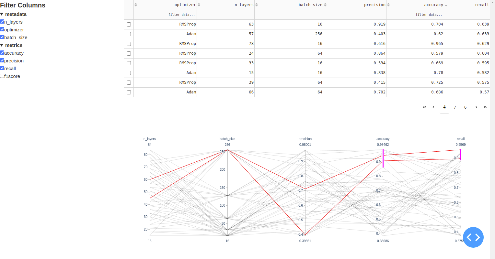

# kahmpehr
Compare multiple ML experiments using Dash

#### Installation
```
pip install .
```
#### Start server
```
kahmpehr --logdir <directory with data> --port <port>
```
#### Data format

2 files are needed in logdir: 

* **results.csv** contains all data to be displayed at kahmpehr. The common approach is to append a new row to this csv each time a ML experiment finishes.
* **columns_metadata** is a dictionary, saved via joblib, which contains information about columns structure. For example, as the csv may potentially contain many columns, it is nice to have them organized like:

```
{'metadata': [n_layers, dataset, optimizer, batch_size, ...],
'metrics': [accuracy, precision, recall, f1score,...]}
```

Then, the filter widget will be organized in the same way.

#### Screenshot



